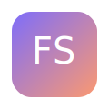

# FlowState

FlowState is a modern, local-first knowledge workspace built with PHP 8, MySQL, and vanilla web technologies. It pairs a playful outlined UI with offline resilience, auto-linking notes, and a living backlink graph.



## Features

- ✍️ Split-pane Markdown editor with live preview and [[wikilink]] support.
- 🔗 Automatic backlink graph powered by TF-IDF re-ranking and persistent edges.
- 🔍 Command palette (⌘/Ctrl + K) for quick search or new note creation.
- 🌐 PWA installability with offline shell, IndexedDB caching, and outbox sync.
- 🌓 Light/Dark themes expressed with OKLCH design tokens.
- 🔒 Session-based auth, CSRF protection, and optimistic concurrency (ETag + If-Match).

## Project Layout

```
public/              # Upload this folder to htdocs/
  index.php          # Application shell and public viewer
  login.php          # Auth entry point
  logout.php         # Calls API logout and redirects
  admin.php          # Authenticated password reset helper
  manifest.webmanifest
  assets/
    css/app.css
    js/{app,api,db,editor,graph}.js
    icons/
api/
  auth.php
  notes.php
  publish.php
config/
  config.example.php # Copy to config.php and fill in secrets
  database.php       # PDO bootstrap (requires config.php)
src/
  Auth.php
  Csrf.php
  Response.php
  TextUtil.php
  LinksRepo.php
  NotesRepo.php
sql/
  schema.sql
  seed.sql
```

## Setup

1. **Create database** – `CREATE DATABASE flowstate CHARACTER SET utf8mb4;`
2. **Import schema** – run `sql/schema.sql`, then `sql/seed.sql`.
3. **Configure app** – copy `config/config.example.php` to `config/config.php` and edit MySQL credentials, base URL, and CSRF secret.
4. **Upload** – copy the entire repository to your PHP host. On InfinityFree place everything inside `htdocs/`, preserving folder structure. Ensure `public/` contents live directly under `htdocs/`.
5. **File permissions** – config files should not be web-accessible. InfinityFree keeps `config/` outside `htdocs/`, so you’re safe.
6. **Login** – open `/login.php` and sign in with the seeded credentials (below).

### InfinityFree checklist

- [ ] Create MySQL database and user via the control panel.
- [ ] Upload `public/*` into `htdocs/`.
- [ ] Upload `api/`, `config/`, `src/`, and `sql/` alongside `htdocs/` (one level up) or keep them sibling directories if your host supports it.
- [ ] Import `schema.sql` followed by `seed.sql` through phpMyAdmin.
- [ ] Copy `config/config.example.php` → `config/config.php` and set credentials.
- [ ] Verify `public/.htaccess` is uploaded for correct MIME headers.
- [ ] Visit `/login.php` and confirm you can authenticate.

### Manual re-indexing

If you bulk-edit notes via SQL, hit `/api/notes.php?action=reindexAll` with the `X-CSRF-Token` header (fetch via `/api/auth.php?action=csrf`) while logged in to rebuild embeddings and graph links.

### Password resets without CLI

While logged in, visit `/admin.php` to change the current user’s password. The page is session-guarded and uses CSRF tokens. You can disable it after use if desired.

## Design Tokens & Components

| Token | Light | Dark |
| --- | --- | --- |
| `--bg` | `oklch(97% 0.02 90)` | `oklch(16% 0.02 260)` |
| `--surface` | `oklch(100% 0 0)` | `oklch(22% 0.02 260)` |
| `--border` | `oklch(80% 0.02 90)` | `oklch(35% 0.03 260)` |
| `--accent` | `oklch(65% 0.14 280)` | `oklch(75% 0.16 280)` |
| `--accent-2` | `oklch(70% 0.15 30)` | `oklch(78% 0.16 30)` |

Component recipes:

- **Card** – `border:2px solid var(--border); border-radius:20px; background:var(--surface); box-shadow:var(--shadow); padding:16px;`
- **Button** – same outline + `box-shadow: var(--shadow);` with hover `translateY(-2px)` and accent gradients.
- **Input** – pill border, `padding: 12px 16px;` focus outline `2px` in accent color.

## Auto-Linking Pipeline

1. After every save, `NotesRepo::reindex` tokenizes Markdown via `TextUtil::tokenize`, strips code, normalizes case, filters stop words (English + Italian), stems lightly, and stores TF weights in `note_terms`.
2. `LinksRepo::updateLinksFor` gathers candidate notes sharing top terms, computes IDF across the corpus, and ranks edges by cosine similarity of TF-IDF vectors. Top 12 become `note_links` entries.
3. Related notes and backlinks are served from `note_links`, so the sidebar and graph stay fast.

## Offline & Sync

- `assets/js/db.js` creates an IndexedDB database with `notes` cache and `outbox` queue.
- Failed mutations enqueue into the outbox; when the browser regains connectivity the queue syncs via the REST API.
- A sync bubble in the footer indicates pending operations.

## Testing

- PHP files follow PSR-12, strict types, and use PDO prepared statements only.
- Use `php -l` on the `api/` and `src/` files if you need a quick lint.

## Seeded credentials

- **Email:** `admin@example.com`
- **Password:** `admin123`

Update the password immediately via `/admin.php` on first deployment.

## How to run locally (XAMPP/MAMP)

1. Place the repo inside your local web root (e.g., `htdocs/FlowState`).
2. Create a MySQL database, import `sql/schema.sql` then `sql/seed.sql`.
3. Copy `config/config.example.php` → `config/config.php` with your local DB credentials (host `localhost`, user/password as needed).
4. Visit `http://localhost/FlowState/public/login.php` and log in with the seed account.

## Admin deployment checklist

- [ ] Database imported (`schema.sql`, `seed.sql`).
- [ ] `config/config.php` populated with correct secrets.
- [ ] `public/manifest.webmanifest` served with proper MIME (see `.htaccess`).
- [ ] Service worker registered after first visit.
- [ ] Optional: run `/api/notes.php?action=reindexAll` post-import.

Enjoy your FlowState! 💜
